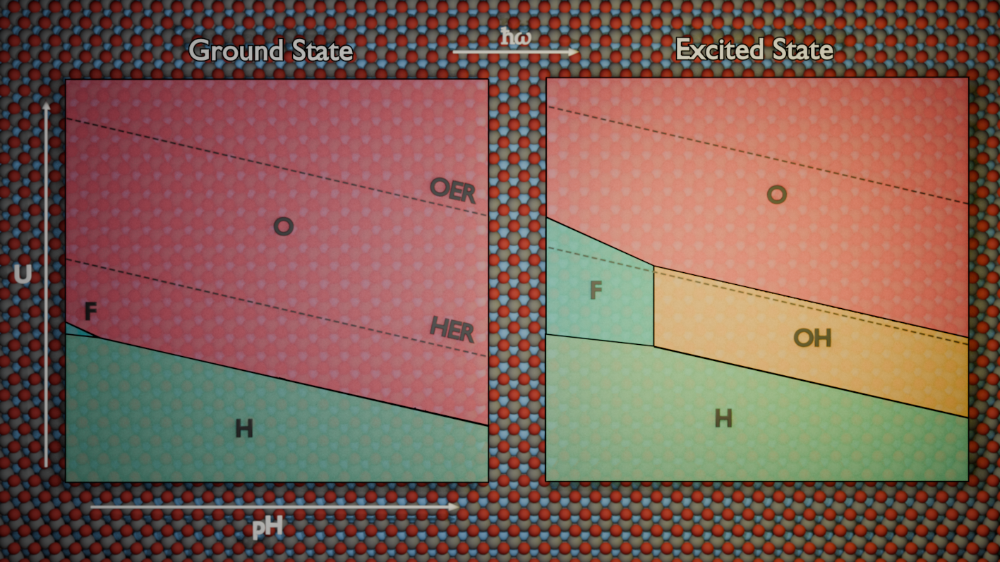

# Plot Pourbaix Diagrams

<br>
<p align="center">

</p>


## About
This repository contains the Python implementation and data used to generate Ground State and Excited State [Pourbaix diagrams](https://en.wikipedia.org/wiki/Pourbaix_diagram) for MXene compounds. The code utilizes a thermodynamic framework to evaluate the stability of various surface terminations as a function of $\mathrm{pH}$ and applied potential ($U$).

It allows users to:
- Automatically generate labeled Pourbaix Diagrams ($\mathrm{pH}$ vs. $U$). (`plot_porubaix()`)
- Plot $\Delta G$ vs. $U$ at a fixed $\mathrm{pH}$. (`plot_dG_vs_U()`)
- Plot $\Delta G$ vs. $\mathrm{pH}$ at a fixed $U$. (`plot_dG_vs_pH()`)

<br>

The main program and functions are found in the `pourbaix_plot.py` script. The `pbe/` and `pbe0/` folders contain example input data, while in the `img/` folder, the resulting images from this data is found, used i our research.

This program was developed for and used in the paper:
```
D. Ontiveros, F. Viñes, C. Sousa, MXenes Surface Termination under Photoexcitation: Insights from Excited-State Pourbaix Diagrams. (Currently under review)
```


## Requirements
```
numpy
pandas
matplotlib
scipy
```


## Usage

The input file (e.g., in `pbe/` or `pbe0/`) should be a space-separated text file with the following structure:
```
dG0      vH     ve    label
0        0      0     clean
-6.668   4      4     O
-4.929   2      2     OH
...
```
where dG0 is the $\Delta G(0,0)$ free energy, vH and ve are the number of protons ($v_{\mathrm{H}^+}$) and electrons, ($v_{e^-}$) involved in the process, and label dictates the name of the phase/termination.

Then, its a matter of using the functions in the `pourbaix_plot.py` file to generate the plots:
```python
from pourbaix_plot import plot_porubaix, plot_dG_vs_U, plot_dG_vs_pH

input_file = "./pbe0/data_zr_s.txt" # example input file
plot_pourbaix(input_file, output="pb_diagram.png", **kwargs)
plot_dG_vs_U(input_file, pH=0, output="dgu_plot.png", **kwargs)
plot_dG_vs_pH(input_file, U=1.23, output="dgph_plot.png", **kwargs)
# **kwargs allows for plot styling and configuration, see docstring for more
```

The `tutorial.ipynb` Jupyter Notebook provides a more detailed usage of the functions and step-by-step examples to reproduce the figures from the paper. 